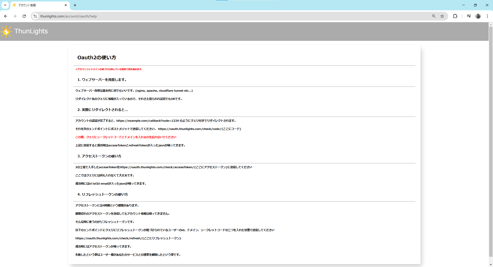

# 昔のドキュメントについて

ドキュメントをDocusaurusで作り直したのには大きな理由があります。

それは2025-1-28以前のドキュメントが簡素すぎて外部どころか内部の人間にすらOauthシステムが知られていなかったからです。

{/* truncate */}

### 昔のドキュメントの内容

こちらがその昔のドキュメントになります。

なんと驚くことに昔のドキュメントは**この1ページのみ**です。

こうなったのには理由があります。
当初このウェブサイトは仮のものでサービス製作がひと段落したら作り直そうというのが私の計画でした。
しかし、あろうことか色々なサービスを開発しているうちにすっかり存在を忘れていました。

そしてこの度ThunLightsのメインのウェブページをSvelteKitに移行する過程で作り直そうという考えに至りました。
当初はthunlights.comに組み込むような形も考えていましたが、せっかくならdocusaurusを使ってみようという事でこのドキュメントを作りました。

### 昔のドキュメントの行方

GitHubにてソースコードを管理している都合上、今も昔のドキュメントのHTMLデータ自体は残っています。
現時点で再公開の予定はありません。

理由は見るに堪えない内容だからです。
適当で書いたのもあって日本語が変だったり所々に説明不備があります。

ThunLightsの10周年記念とかになったら公開するかもですね。
見たい方は気長にお待ちください。
